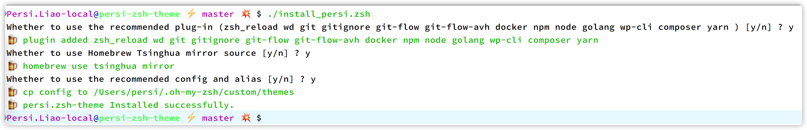

# PersiLiao Zsh Theme

[README](/README.md "README") | [中文文档](/README_zh.md "中文文档")

## Features
  * Command prompt supports git status 
  * `ls` output highlight color display

## Require

- zsh
- [oh-my-zsh](https://github.com/ohmyzsh/ohmyzsh "oh-my-zsh")

## Installation

```sh
$ git clone --depth=1 https://github.com/persiliao/persi-zsh-theme
$ cd persi-zsh-theme
$ ./install.sh
$ omz reload
```

## Preview



## License

**MIT License**

## JetBrains Support

**The project has always been developed in the Idea integrated development environment under JetBrains, based on the
free JetBrains Open Source license(s) genuine free license, I would like to express my gratitude here**
