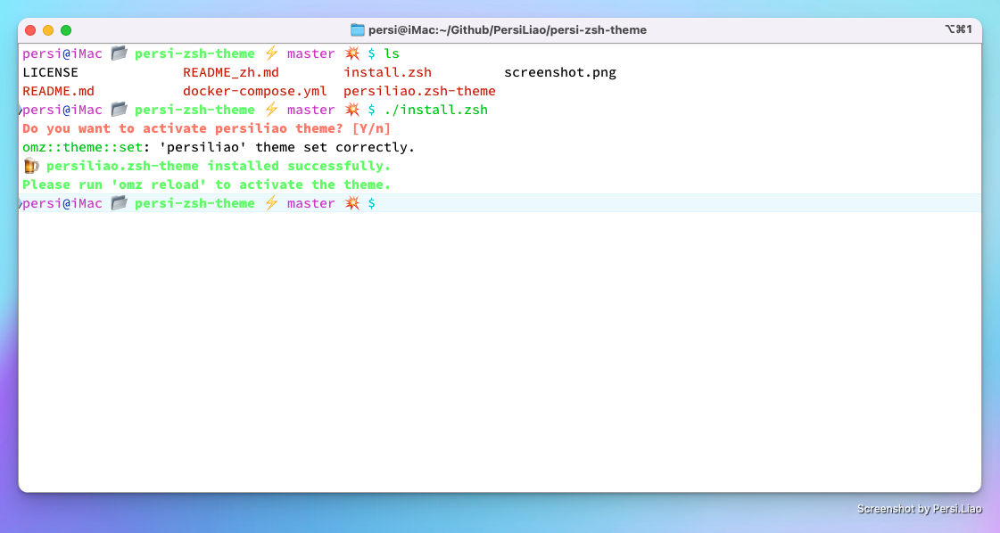

# Persi Zsh Theme

[README](/README.md "README") | [中文文档](/README_zh.md "中文文档")

---

## Require

- zsh
- [oh-my-zsh](https://github.com/ohmyzsh/ohmyzsh "oh-my-zsh")

## Installation

```sh
$ git clone --depth=1 https://github.com/persiliao/persi-zsh-theme
$ cd persi-zsh-theme
$ ./install_persi.zsh
$ omz reload
```

## Alias Commands

| Alias    | Command                                                 | Example                             |
|:---------|:--------------------------------------------------------|:------------------------------------|
| `gcmsg`  | `git commit -m`                                         | `gcmsg Updated README.md`           |
| `gcmsgd` | `git commit --amend -m`                                 | `gcmsgd Modify last commit message` |
| `gacmsg` | `git add . && git commit -m`                            | `gacmsg Add new feature`            |
| `gsurm`  | `git submodule update --recursive --remote --merge`     |                                     |

| Alias                   | Example                                                        |
|:------------------------|:---------------------------------------------------------------|
| `showSystemVersion`     | `Display system version`                                       |
| `showPath`              | `Display Path`                                                 |
| `showCPUTopProcess`     | `Display the top 10 that the system occupies the most CPU`     |
| `showMemoryTopProcess`  | `Display the top 10 that the system occupies the most Memory`  |

## Preview



## License

**MIT License**

## JetBrains Support

**The project has always been developed in the Idea integrated development environment under JetBrains, based on the
free JetBrains Open Source license(s) genuine free license, I would like to express my gratitude here**


